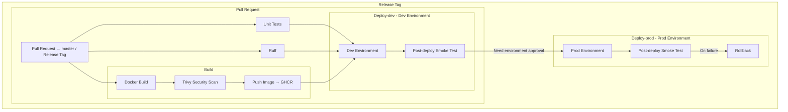

# Description
CI/CD pipeline for a minimal FastAPI application demonstrating a complete software delivery lifecycle using uv, Docker and GitHub Actions.
The pipeline validates changes on pull requests, builds and scans container images, publishes images to GHCR, promotes changes to a mocked development environment, and uses GitHub Releases and a protected production Environment to simulate controlled production deployment.

## Pull Request workflow
<ol>
<li>Create a feature branch.</li>
<li>Make a code change.</li>
<li>Push the branch.</li>
<li>Open a Pull Request against master.</li>
<li>GitHub Actions automatically runs:</li>
<li>unit tests</li>
<li>Ruff</li>
<li>Docker build</li>
<li>Trivy vulnerability scan</li>
<li> GHCR push</li>
<li> A failed quality/security check prevents the pipeline from progressing to deployment.</li>
</ol>

## Development deployment

When changes are merged into `master`, the workflow builds and pushes the image and deploys it to the `dev` GitHub Environment.

In a real-world setup this step would invoke the deployment mechanism of the target platform, for example Kubernetes or ECS. There is no rollback step in Dev-deploy stage for debuging reasons.

## Production release

Production deployments are triggered by publishing a GitHub Release.

Example:

1. Create a tag `v1.0.0`.
2. Create a GitHub Release for that tag.
3. Publish the Release.
4. GitHub Actions starts the release workflow.
5. The image is built, scanned and pushed as:
   
   `ghcr.io/gspyrka/ci-flow-example:v1.0.0`

6. The image is deployed to the `dev` Environment.
7. The workflow reaches the `prod` Environment.
8. GitHub pauses the deployment and requests approval from a configured
   Required Reviewer.
9. After approval, the production deployment runs.

Production is protected using a dedicated GitHub Environment named prod. The Environment has Required reviewers enabled. Therefore, a release cannot automatically proceed to the production deployment step. This represents a real-world deployment gate such as change approval or release authorization.
## Flow chart

# Why this design?

## Separate CI jobs

Unit tests, linting and image building are separated into independent jobs. Deployment jobs depend on successful validation, making the quality gates explicit in the GitHub Actions workflow.

## Dev before production

Production deployment depends on successful development deployment using needs: deploy-dev. This models promotion of the same validated artifact through environments instead of treating production as an independent deployment.

## Artifact promotion

Images are tagged using the commit SHA for CI builds and the GitHub Release tag for production releases. Image tag assocaited with commit SHA is good for troubleshooting.

**Example:**

`ghcr.io/gspyrka/ci-flow-example:<commit-sha>`

`ghcr.io/gspyrka/ci-flow-example:v1.0.0`

The production deployment uses the image associated with the release tag rather than rebuilding application code during deployment.

## Requirements

| Requirement             | Implementation                          | Status    |
| ----------------------- | --------------------------------------- | --------- |
| Package management      | uv + uv.lock                            | ✅ Real    |
| Dependency installation | uv sync --locked                        | ✅ Real    |
| Lint                    | Ruff                                    | ✅ Real    |
| Unit tests              | pytest + FastAPI TestClient             | ✅ Real    |
| Docker build            | Docker Buildx                           | ✅ Real    |
| Vulnerability scanning  | Trivy                                   | ✅ Real    |
| Container registry      | GitHub Container Registry               | ✅ Real    |
| Dev deployment          | GitHub Environment `dev`                | 🟡 Mocked |
| Production release      | GitHub Release + tag                    | ✅ Real    |
| Production gate         | `prod` Environment + Required reviewers | ✅ Real    |
| Production deployment   | GitHub Environment `prod`               | 🟡 Mocked |
| Smoke test              | Post-deployment check                   | 🟡 Mocked |
| Rollback                | Failure handler                         | 🟡 Mocked |